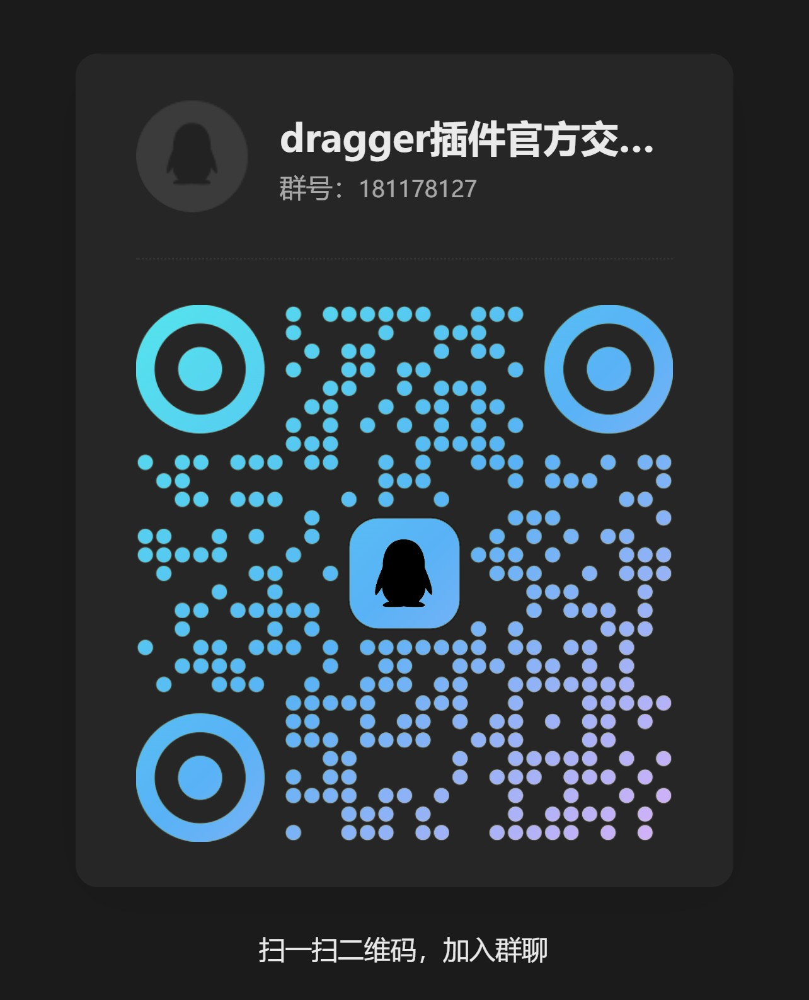

[](README.md) [](README.zh-CN.md)

# Dragger

**Drag and drop any block to rearrange content in Obsidian — just like Notion.**

     [](https://deepwiki.com/Ariestar/obsidian-dragger)


## Features

- 🧱 **Block-level drag & drop** — paragraphs, headings, lists, tasks, blockquotes, callouts, tables, code blocks, math blocks
- 📐 **Nested drag** — horizontal position controls indent level; vertical position controls insertion row
- 🔗 **Multi-line selection drag** — click or long-press to select a range, then drag as a group; native checkboxes mark selected blocks on desktop
- 🎨 **Customizable handles** — 4 icon styles (dot / grip-dots / grip-lines / square), adjustable size, color, and horizontal offset
- 📍 **Visual drop indicator** — glowing line shows exactly where the block will land
- 📱 **Mobile support** — long-press drag mode, bottom toolbar block type conversion, edge auto-scroll during drag
- ⌨️ **Keyboard shortcuts** — press Escape to exit multi-select mode on desktop
- 🗑️ **Block type menu with delete** — convert block types or delete the current block from the context menu

## Installation

### Community Plugins

Open **Settings → Community plugins → Browse**, search **Dragger**, and install.

### Manual

Download `main.js`, `manifest.json`, and `styles.css` from the [latest release](https://github.com/Ariestar/obsidian-dragger/releases), then copy them into:

```
<your-vault>/.obsidian/plugins/dragger/
```

Restart Obsidian and enable the plugin.

## Headless core package

Dragger also publishes a platform-agnostic npm core. It does not import Obsidian, CodeMirror, DOM events, or editor dispatch APIs.

```bash
npm install dragger
```

Stable entry points:

```ts
import { createDragPipeline } from 'dragger/drag';
import { createMoveCommand, planBlockCommandTransaction } from 'dragger/domain';
import { getLineMap, parseLineWithQuote } from 'dragger/markdown';
```

For another editor platform, adapt host events into core values:

- `BlockSelection`
- `DragDropSnapshot`
- `DropResolution`
- `PipelineEvent`
- `PipelineOutput`

`previewData` on `DragDropSnapshot<TPreview>` is platform-private rendering data. For example, CodeMirror stores the resolved drop-indicator geometry there. The core keeps the type and passes it back on `PipelineOutput`; it never reads or mutates that data.

See [`examples/headless-platform`](examples/headless-platform) for the minimal adapter shape.

## Usage

1. **Hover** on the left edge of any block to reveal the drag handle
2. **Drag** the handle to the target position — a glowing indicator shows where the block will be inserted
3. **Release** to drop the block into place

**Nested lists & blockquotes:** move the cursor horizontally while dragging to control indent level.

**Multi-line selection:** long-press (touch) or click multiple handles to select a range, then drag the entire selection. Press **Escape** to exit multi-select.

**Mobile text long-press drag:** when enabled, long-press a text line or rendered block content to drag a single block directly without reaching for the left handle.

**Block type conversion:** right-click a handle (desktop) or use the bottom toolbar (mobile) to convert block types or delete the current block.

> 💡 **Tip:** Enable line numbers in Obsidian settings for a better experience — the handle appears right at the line-number gutter.

## Settings

| Setting | Description | Default |
|---------|-------------|---------|
| **Handle color** | Follow theme accent or pick a custom color | Theme |
| **Handle visibility** | Hover / Always visible / Hidden | Hover |
| **Handle icon** | ● Dot / ⠿ Grip-dots / ☰ Grip-lines / ■ Square | Grip-dots |
| **Handle size** | 12 – 28 px | 20 px |
| **Handle horizontal offset** | Shift handle left (−80) or right (+80) px | 0 px |
| **Indicator color** | Follow theme accent or pick a custom color | Theme |
| **Multi-line selection** | Enable range-select-then-drag workflow | On |
| **Mobile text long-press drag** | On mobile, long-press a text line or rendered block content to drag a single block directly | On |
| **Cross-file drag** | Allow dragging blocks into another open file editor | Off |
| **Drag source visual style** | Shared style set used by drag-source and list-drop highlights (Outline only / Subtle highlight / Filled highlight) | Subtle highlight |
| **Drag source highlight** | Toggle highlight for the block being dragged | On |
| **List drop highlight** | Toggle highlight for list drop target area | On |

## Compatibility

- Obsidian **≥ 1.0.0**
- Desktop (Windows, macOS, Linux) + Mobile (Android tested)

## Roadmap

- Multi-column layout — drag blocks into side-by-side columns
- More style customization — handle icons, colors, themes
- Interaction refinements — better visual feedback, smoother gestures
- Cross-document drag — move blocks between different notes

## Development

```bash
npm install
npm run dev       # watch mode with hot reload
npm run build     # production build
npm run test      # run Vitest suite (229 tests)
npm run typecheck # TypeScript type checking
npm run lint -- --max-warnings=0
```

## License

[MIT](LICENSE)

## Contributing

PRs and issues are welcome!

If this plugin helps you, a ⭐ on GitHub would mean a lot.

## Community

| QQ Group | WeChat Donate |
|:--------:|:-------------:|
|  |  |
